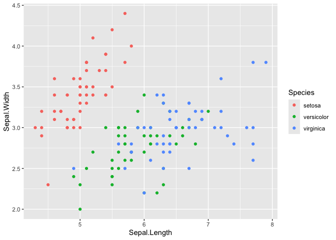
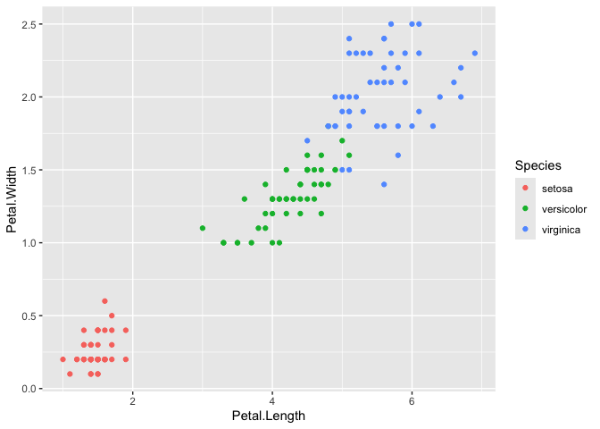
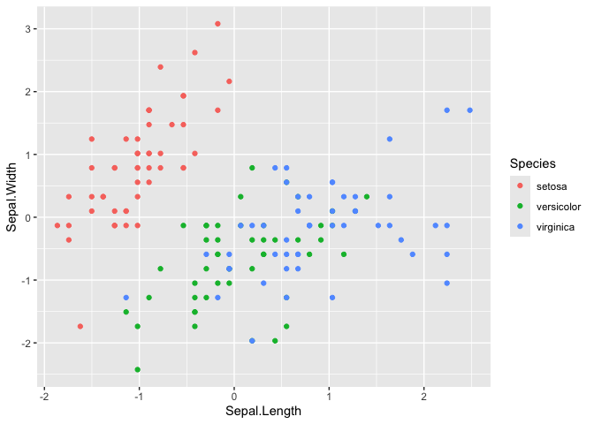
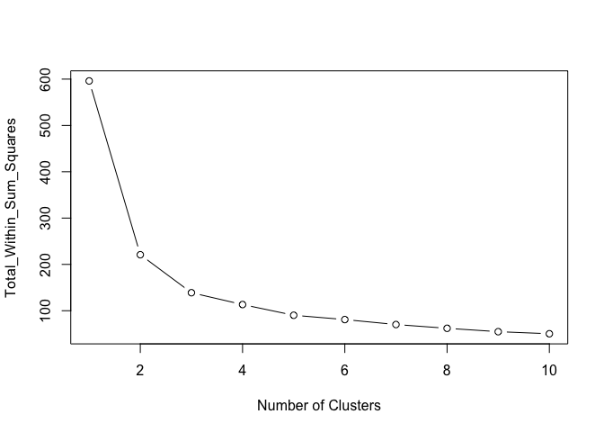
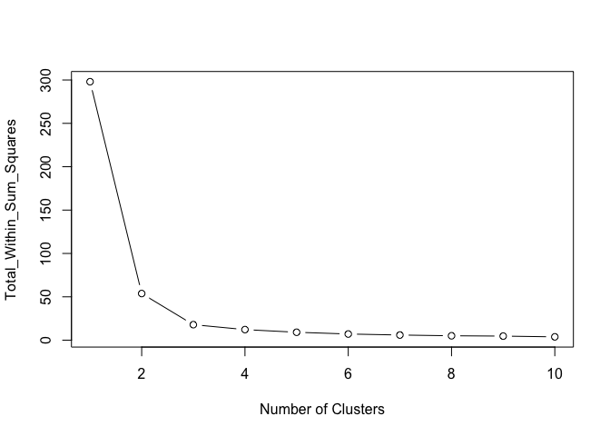
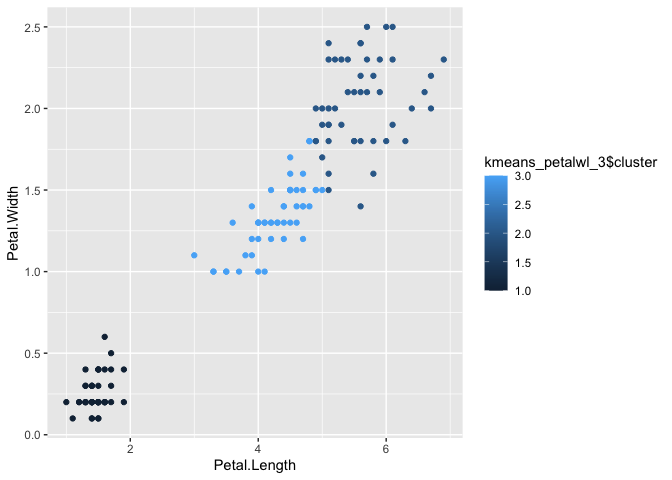

Clustering Analysis on Iris
================

**Import Packages and IDE Prep**

``` r
#rm(list = ls())
set.seed(2)
library(kernlab, plyr)
library(kknn)
library(tidyverse)
```

    ## ── Attaching core tidyverse packages ──────────────────────── tidyverse 2.0.0 ──
    ## ✔ dplyr     1.1.4     ✔ readr     2.1.5
    ## ✔ forcats   1.0.0     ✔ stringr   1.5.1
    ## ✔ ggplot2   3.5.1     ✔ tibble    3.2.1
    ## ✔ lubridate 1.9.3     ✔ tidyr     1.3.1
    ## ✔ purrr     1.0.2     
    ## ── Conflicts ────────────────────────────────────────── tidyverse_conflicts() ──
    ## ✖ ggplot2::alpha() masks kernlab::alpha()
    ## ✖ purrr::cross()   masks kernlab::cross()
    ## ✖ dplyr::filter()  masks stats::filter()
    ## ✖ dplyr::lag()     masks stats::lag()
    ## ℹ Use the conflicted package (<http://conflicted.r-lib.org/>) to force all conflicts to become errors

``` r
library(stats)
options(scipen=999)
```

**Read in Dataset(s)**

``` r
data(iris)
head(iris,10)
```

    ##    Sepal.Length Sepal.Width Petal.Length Petal.Width Species
    ## 1           5.1         3.5          1.4         0.2  setosa
    ## 2           4.9         3.0          1.4         0.2  setosa
    ## 3           4.7         3.2          1.3         0.2  setosa
    ## 4           4.6         3.1          1.5         0.2  setosa
    ## 5           5.0         3.6          1.4         0.2  setosa
    ## 6           5.4         3.9          1.7         0.4  setosa
    ## 7           4.6         3.4          1.4         0.3  setosa
    ## 8           5.0         3.4          1.5         0.2  setosa
    ## 9           4.4         2.9          1.4         0.2  setosa
    ## 10          4.9         3.1          1.5         0.1  setosa

**Exploratory Data Analysis**

``` r
#dimensions
dim = dim(iris)
dim
```

    ## [1] 150   5

``` r
#View unique values in response variable (species)
unique_species = unique(iris['Species'])
unique_species
```

    ##        Species
    ## 1       setosa
    ## 51  versicolor
    ## 101  virginica

``` r
#summary stats on IRIS
summary(iris)
```

    ##   Sepal.Length    Sepal.Width     Petal.Length    Petal.Width   
    ##  Min.   :4.300   Min.   :2.000   Min.   :1.000   Min.   :0.100  
    ##  1st Qu.:5.100   1st Qu.:2.800   1st Qu.:1.600   1st Qu.:0.300  
    ##  Median :5.800   Median :3.000   Median :4.350   Median :1.300  
    ##  Mean   :5.843   Mean   :3.057   Mean   :3.758   Mean   :1.199  
    ##  3rd Qu.:6.400   3rd Qu.:3.300   3rd Qu.:5.100   3rd Qu.:1.800  
    ##  Max.   :7.900   Max.   :4.400   Max.   :6.900   Max.   :2.500  
    ##        Species  
    ##  setosa    :50  
    ##  versicolor:50  
    ##  virginica :50  
    ##                 
    ##                 
    ## 

**Visualize data**

``` r
ggplot(data = iris, aes(Sepal.Length, Sepal.Width, color = Species)) + geom_point()
```

<!-- -->

``` r
ggplot(data = iris, aes(Petal.Length, Petal.Width, color = Species)) + geom_point()
```

<!-- -->

**Scale IRIS dataset**

``` r
##scale data
iris_scaled = scale(iris[,1:4], center = TRUE, scale = TRUE)
iris_scaled = as.data.frame(iris_scaled)
iris_scaled['Species'] = iris[,5]
head(iris_scaled,5)
```

    ##   Sepal.Length Sepal.Width Petal.Length Petal.Width Species
    ## 1   -0.8976739  1.01560199    -1.335752   -1.311052  setosa
    ## 2   -1.1392005 -0.13153881    -1.335752   -1.311052  setosa
    ## 3   -1.3807271  0.32731751    -1.392399   -1.311052  setosa
    ## 4   -1.5014904  0.09788935    -1.279104   -1.311052  setosa
    ## 5   -1.0184372  1.24503015    -1.335752   -1.311052  setosa

**Visualize Scaled IRIS DS –Note there is clearer clustering with Petal
Length & Petal Width**

``` r
ggplot(data = iris_scaled, aes(Sepal.Length, Sepal.Width, color = Species)) +
  geom_point()
```

<!-- -->

``` r
ggplot(data = iris_scaled, aes(Petal.Length, Petal.Width, color = Species)) +
  geom_point()
```

<!-- -->

**In order to find the optimal number of centers lets make an elbow
diagram using All 4 predictors**

``` r
#for loop to grab the total within sum of squares from each kmeans model with varying number of centers
results_df_kmeans_elbow = data.frame(center = numeric(), totwithinss = numeric()) 
for (center in seq(1,10)) {
  kmeans = kmeans(iris_scaled[,1:4], centers = center, nstart = 10)
  totwithinss = kmeans$tot.withinss
  results_df_kmeans_elbow = rbind(results_df_kmeans_elbow, data.frame(center = center, totwithinss = totwithinss)) 
}

plot(x = results_df_kmeans_elbow$center, y = results_df_kmeans_elbow$totwithinss
     ,type = 'b', xlab = 'Number of Clusters', ylab = 'Total_Within_Sum_Squares')
```

<!-- -->

**Elbow Diagram using only Petal predictors based on earlier graphs
where there is better clustering using only petal predictors**

``` r
#for loop to grab the total within sum of squares from each kmeans model with varying number of centers
results_df_kmeans_elbow_petals = data.frame(center = numeric(), totwithinss = numeric()) 
for (center in seq(1,10)) {
  kmeans = kmeans(iris_scaled[,3:4], centers = center, nstart = 10)
  totwithinss = kmeans$tot.withinss
  results_df_kmeans_elbow_petals = rbind(results_df_kmeans_elbow_petals, data.frame(center = center, totwithinss = totwithinss)) 
}


plot(x = results_df_kmeans_elbow_petals$center, y = results_df_kmeans_elbow_petals$totwithinss
     ,type = 'b', xlab = 'Number of Clusters', ylab = 'Total_Within_Sum_Squares')
```

<!-- -->

**3 clusters seems to be the most promising based on the elbow diagram
on the Petal predictors (petal.length & petal.width)**

**Lets view model for 3 clusters using only petal width and petal length
as our predictors**

``` r
kmeans_petalwl_3 = kmeans(iris[,3:4], centers = 3, nstart = 10)
kmeans_petalwl_3
```

    ## K-means clustering with 3 clusters of sizes 50, 48, 52
    ## 
    ## Cluster means:
    ##   Petal.Length Petal.Width
    ## 1     1.462000    0.246000
    ## 2     5.595833    2.037500
    ## 3     4.269231    1.342308
    ## 
    ## Clustering vector:
    ##   [1] 1 1 1 1 1 1 1 1 1 1 1 1 1 1 1 1 1 1 1 1 1 1 1 1 1 1 1 1 1 1 1 1 1 1 1 1 1
    ##  [38] 1 1 1 1 1 1 1 1 1 1 1 1 1 3 3 3 3 3 3 3 3 3 3 3 3 3 3 3 3 3 3 3 3 3 3 3 3
    ##  [75] 3 3 3 2 3 3 3 3 3 2 3 3 3 3 3 3 3 3 3 3 3 3 3 3 3 3 2 2 2 2 2 2 3 2 2 2 2
    ## [112] 2 2 2 2 2 2 2 2 3 2 2 2 2 2 2 3 2 2 2 2 2 2 2 2 2 2 2 3 2 2 2 2 2 2 2 2 2
    ## [149] 2 2
    ## 
    ## Within cluster sum of squares by cluster:
    ## [1]  2.02200 16.29167 13.05769
    ##  (between_SS / total_SS =  94.3 %)
    ## 
    ## Available components:
    ## 
    ## [1] "cluster"      "centers"      "totss"        "withinss"     "tot.withinss"
    ## [6] "betweenss"    "size"         "iter"         "ifault"

**Graphing predictions (k = 3, Petal.Length & Petal.Width)**

``` r
ggplot(iris, aes(Petal.Length, Petal.Width, color = kmeans_petalwl_3$cluster)) + geom_point()
```

<!-- -->
